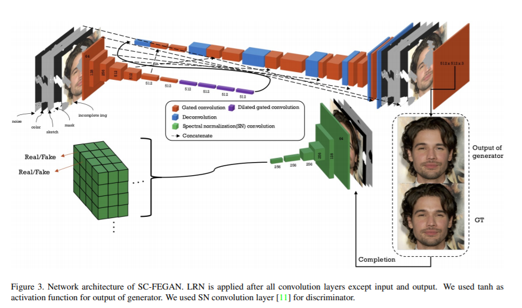

# SC-FEGAN: Face Editing Generative Adversarial Network with User's Sketch and Color
(arxiv:1902.06838)

```
@InProceedings{Jo_2019_ICCV,
  author = {Jo, Youngjoo and Park, Jongyoul},
  title = {SC-FEGAN: Face Editing Generative Adversarial Network With User's Sketch and Color},
  booktitle = {The IEEE International Conference on Computer Vision (ICCV)},
  month = {October},
  year = {2019}
}
```

Read The Complete paper <a href='https://arxiv.org/abs/1902.06838'>here</a><br />
Evaluation Code From Authors Available <a href='https://github.com/run-youngjoo/SC-FEGAN'>here</a>

<br />

###### This implementation is according to the best of my understanding of the paper and some components might be different than the original.
_____________________________________________________________________________________
#### Summary

This paper introduces a novel method for editing or generating facial features using guiding information from line strokes and color information.
Certain parts of the face can be masked and reconstructed providing guiding information in the form of line strokes. Furthermore, the masks can be painted with certain colors to provide the color information which is used by the model to regenerate the painted region with that color information.
The techniques mentioned could be useful for regenerating obstructed or damaged facial images, or to introduce new features to a face. A new face can also be generated by masking the whole face.
The model depends on the generator generating real like features, and trains using custom GAN Loss along with specific loss functions for the discriminator and generator.

_____________________________________________________________________________________


#### Data Generation And Preprocessing
1. Celeba HQ Dataset is used with 29k training and 1k testing images
2. Image shape (512, 512)
3. The input to the generator is (512, 512, 9) => 
    3.1 RGB Incomplete Image (512, 512, 3)
    3.2 Binary Mask Which Removes Certain Sections Of The Image(512, 512, 1)
    3.3 Sketch, immitating the use input for guided completion (512, 512, 1)
    3.4 Color Information, The median color information of different segments of the face, useful for passing color information and avoiding artifacts. (512, 512, 3)
    3.5 Random Noise (512, 512, 1)

4. Binary Mask is generated following the algorithm mentioned in the SN-PatchGAN paper

5. Face is segmented into different sections namely : [
  '0, background', '1, skin', '2, left eyebrow', '3, right eyebrow',
  '4, left eye', '5, right eye', '6, glasses', '7, left ear', '8, right ear', '9, earings',
  '10, nose', '11, mouth', '12, upper lip', '13, lower lip',
  '14, neck', '15, neck_l', '16, cloth', '17, hair', '18, hat'
]

6. The image is blurred using bilateral filter and median filter, then the segments are used to get the median color of each segment and each segment is assigned the median color and then multiplied with the mask to get the color information of that region only.

7. Sketch information is retrieved using edge detection and applying the mask to it.

8. Random noise is generated using gaussian distribution.

9. Input to discriminator is (512, 512, 8) =>
9.1 Ground truth image, or completed image, i.e., the output of the generator for the masked region and the non masked region replaced by the ground truth image (512, 512, 3)
9.2 Binary Mask (512, 512, 1)
9.3 Sketch (512, 512, 1)
9.4 Color Information (512, 512, 3)
#### Architecture

1. *<b>Discriminator</b>*
>* Discriminator has <a href='https://arxiv.org/abs/1806.03589'>SN-PatchGAN</a> structure.
>* ReLU isn't used and 3x3 kernels are used.
>* Additional gradient penalty term is used to avoid output patch reaching values close to zero.
<br/>

2. *<b>Generator</b>*
>* Generator is based on U-Net like autoencoder architecture.
>* The core architecture is that of U-Net with the convolutions replaced with <a href='https://arxiv.org/abs/1806.03589'>gated convolutions</a>.
>* The kernels are all 3x3
>* <a href='https://arxiv.org/abs/1710.10196'>Local signal normalization (LRN)</a> is used for all convolutions except input and output layers after the feature map convolutions.
>* Generator recieves HxWx9 input, where 9 channels are.
>>* 3x RGB input image.
>>* 3x for the color information for the masked region.
>>* 1x for binary mask (masked region).
>>* 1x for the stroke information (binary).
>>* 1x for binary noise.
>* The encoder of the generator downsamples input 7 times using stride = 2.
>* Dilated convolutions are used before upsampling.
>* Decoder uses transposed convolutions.
>* ReLU activation is used for all hidden layers.
>* Output Layer is tanh activated.
>* There are 16 hidden layers in total in the generator.
>* The output is an RGB image of the same dimesions as the input.
>* Only the masked part of the image from the generator is used and the rest of the image is the original image for maintaining quality of the image and avoid additional noise in reconstruction and this allows for the generator to be trained on the masked region exclusively.

<br/>




_____________________________________________________________________________________
##### Loss Functions

* I<sub>comp</sub> = Completed image. (The original image with the masked region replaced by the generators activation for the masked region)

* I<sub>gen</sub> = Output Of The Generator.

* I<sub>gt</sub> = The input image.

* N<sub>a</sub> = Number of elements of <b><i>a</i></b>

* M = mask

* $\theta_{q}$ = Feature map of the qth layer of the VGG-16

* $\beta$ = 0.001

* $\sigma$ = 0.05

* $\gamma$ = 120

* $\epsilon$ = 0.001

* $\theta$ = 10

* $\nu$ = 0.1

1. <b>L<sub>G_SN</sub></b> = $-D(I_{comp})$ => -1 * The activation of discriminator on the completed image.

2. <b>L<sub>ppxl</sub></b> = $\frac{1}{N_{gt}}\cdot|| M \odot (I_{gen} - I_{gt})|| + \frac{\alpha}{N_{gt}}||(1-M)\odot(I_{gen}-I_{gt})||$ => Calculates $L_{1}$ distance between the ground truth and the generated image.

3. <b>L<sub>percept</sub></b> = $\sum_{q}||\frac{\theta_{q}(I_{gen}) - \theta_{q}(I_{gt})}{N_{\theta_{q}(I_{gt})}}||+\sum_{q}||\frac{\theta_{q}(I_{comp}) - \theta_{q}(I_{gt})}{N_{\theta_{q}(I_{gt})}}||$ => Computes the $L_{1}$ loss in the feature space. A Pretrained VGG-16 model trained on face recognition is used to generate face encodings for both the completed(original image with masked part replaced by the generated) and whole generated image and the $L_{1}$ distance is calculated with the original image encodings.
Only a few layer activations are used instead of the final activations. In the paper pool1, pool2 and pool3 layers are used.

4. <b>L<sub>style</sub>(I)</b> = $\sum_{q}\frac{1}{C_{q}C_{q}}\cdot||\frac{(G_{q}(I) - G_{q}(I_{gt}))}{N_{q}}||$ , where $G_{q} = (\theta_{q}(x)^T(\theta-q(x)))$ is the Gram matrix to perform autocorrelation on each feature map of VGG-16 and $q(x)$ is the activation of the qth layer. => Computes the content of the two images using gram matrix.

5. <b>L<sub>tv</sub></b> =

> <b>L<sub>tv-row</sub></b><br/>
> <b>L<sub>tv-col</sub></b>

6. <b>L<sub>G</sub></b> = $\mathbb{E}[(||\nabla_{U}D(U)\odot M||_{2} -1)^2]$ => The WGAN Loss.
_____________________________________________________________________________________

#### Training Process : 
